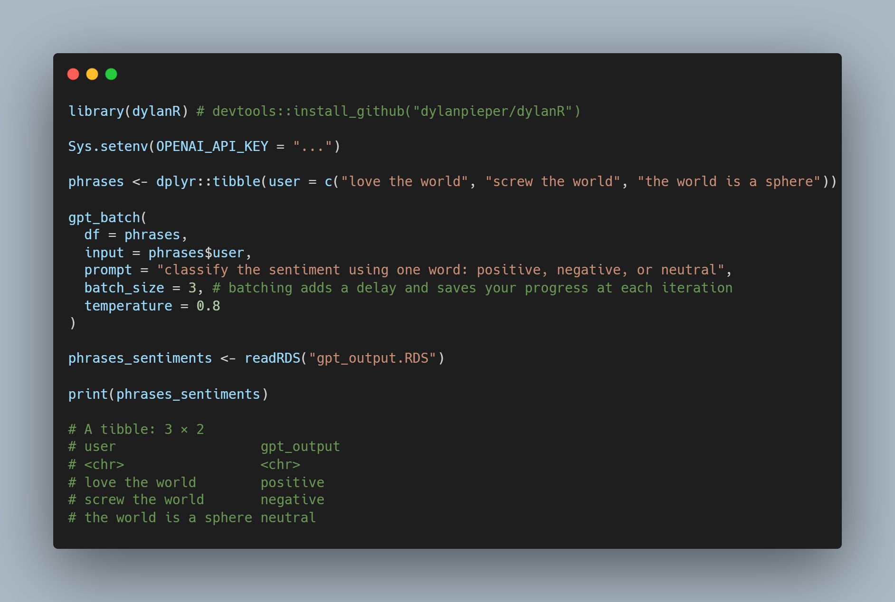

# gpt_batch()



```{r}
library(dylanR) # devtools::install_github("dylanpieper/dylanR")

Sys.setenv(OPENAI_API_KEY = "...")

objects <- dplyr::tibble(user = c("screw the world", "love the world", "the world is round"))

gpt_batch(
  df = objects,
  input = objects$user,
  prompt = "classify the sentiment using one word: 'positive', 'negative', or 'neutral'.",
  batch_size = 3, # batching adds a delay and saves your progress at each iteration
  temperature = 0.8
)

objects_described <- readRDS("gpt_output.RDS")

print(objects_described)

# user               gpt_output
# <chr>              <chr>
# screw the world    negative
# love the world     positive
# the world is round neutral
```

Example of batching:


